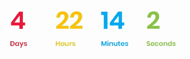

## Демо
[Github Pages](https://pizekatto.github.io/eventify/)
## Запуск
```bash
npm start
```
## Компоненты
### Sticky Navbar
Navbar переходит в состояние `Sticky` используя `Intersection Observer`. Логотип меняется на телефонном разрешении через `mediaQueryList`. Секции отслеживаются и подсвечиваются. Переходы по якорям с эффектом `SmoothScroll`.
### Date Timer


Таймер обратного отсчета
### Tabs


Табы на `input type="radio"`
### Slider control


Кнопка пуска и паузы слайдера на SVG с анимацией паузы между слайдами. Запускается по достижению видимости.
### Ресурсы
#### lorem-ipsum
Для вставки произвольного текста через `data-` атрибут использована библиотека [lorem-ipsum.js](https://github.com/knicklabs/lorem-ipsum.js)
#### slider
Слайдер выполнен с использованием библиотеки [Swiper](https://github.com/nolimits4web/Swiper)